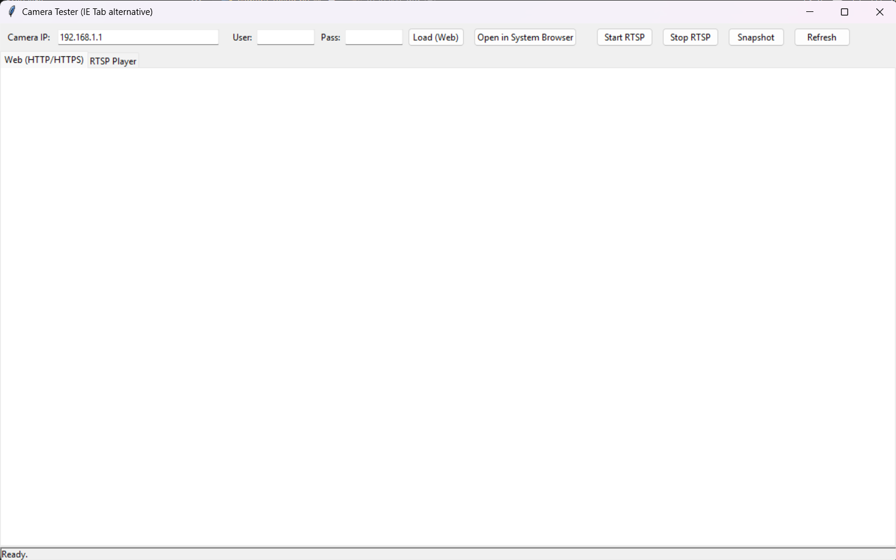

# Camera Tester (IE Tab Alternative)

A cross-platform desktop app for testing IP cameras using Python and Tkinter. Provides an embedded browser (via tkinterweb) and an RTSP video player (via OpenCV) for easy camera access and snapshot capture.

## Features
- URL bar with basic-auth helpers for HTTP(S) camera pages
- Embedded browser using tkinterweb (fallback-friendly)
- RTSP viewer using OpenCV on a Tkinter canvas (threaded)
- Start / Stop / Refresh controls
- Snapshot capture to `./snapshots` with timestamped filenames
- Cross-platform (Windows/Linux). No admin rights required

## Limitations
- Does **not** support legacy IE ActiveX plugins
- tkinterweb is a simple HTML renderer; modern JS-heavy pages may not fully work
- For full Chromium support, consider a variant using cefpython3 (heavier)

## Installation

1. Install Python 3.10+ (Windows/Linux)
2. Install dependencies:
   ```sh
   pip install opencv-python pillow tkinterweb requests
   ```
3. Run the app:
   ```sh
   python camera_tester.py
   ```

## Usage
- Enter the camera IP, username, and password
- Use "Load (Web)" to view HTTP/HTTPS camera pages
- Use "Start RTSP" to view RTSP streams
- Use "Snapshot" to save a frame to the `snapshots` folder
- Use "Open in System Browser" for full browser support


## File Structure
- `camera_tester.py` — Main application
- `snapshots/` — Saved images
- `build/` — PyInstaller build output (if used)

## Tested On
- Windows 11
- Ubuntu 22.04

## License
MIT License
