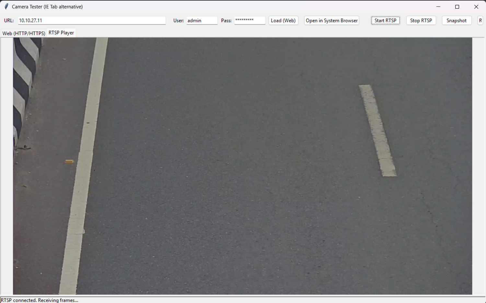

Camera Tester: The Ultimate IE Tab Alternative
Are you looking for a modern, reliable, and free IE Tab alternative for managing your IP cameras? Look no further. Camera Tester is a cross-platform desktop application designed to replace outdated browser plugins and legacy solutions.

Built with Python and Tkinter, this tool provides a seamless experience for viewing and testing IP cameras on both Windows and Linux, without the need for ActiveX controls or other browser dependencies.

Why Camera Tester is the Best IE Tab Alternative 🖥️
Cross-Platform Compatibility: Unlike IE Tab which is Windows-only, Camera Tester works flawlessly on both Windows and Linux, providing a consistent toolset for all your devices.

No Browser Lock-in: This is a standalone application. You don't need a specific browser or an extension. It's a true, independent ActiveX alternative for camera management.

Dual-Functionality:

Embedded Browser: Quickly access a camera's web configuration page. Perfect for simple HTTP/HTTPS interfaces that required legacy browser support.

Dedicated RTSP Player: View live video streams using a high-performance RTSP viewer powered by OpenCV. It's fast, efficient, and built for purpose.

Lightweight & Portable: The application is lean and requires no administrative rights to run. It's the perfect tool for technicians and IT professionals.

Features That Make a Difference 🚀
URL Bar with Basic-Auth Helpers: Quickly connect to cameras with built-in support for username and password authentication.

One-Click Snapshot Capture: Save high-quality, timestamped snapshots of your camera feed with a single button click.

"Open in System Browser" Feature: For complex, JS-heavy pages, you can instantly open the camera URL in your default system browser (e.g., Chrome, Firefox).

Getting Started: Installation & Usage Guide
Installation
Ensure you have Python 3.10+ installed on your system.

Install the required libraries via pip:

Bash

pip install opencv-python pillow tkinterweb requests
Run the application:

Bash

python camera_tester.py
Usage
Enter the camera IP, username, and password in the top bar.

Use "Load (Web)" to view the HTTP/HTTPS configuration page.

Use "Start RTSP" to begin streaming the live video.

Click "Snapshot" to save a frame to the snapshots folder.

Limitations
Does not support legacy IE ActiveX plugins.

The embedded browser is a simple HTML renderer; modern, JS-heavy pages may not work fully.

License
This project is licensed under the MIT License.